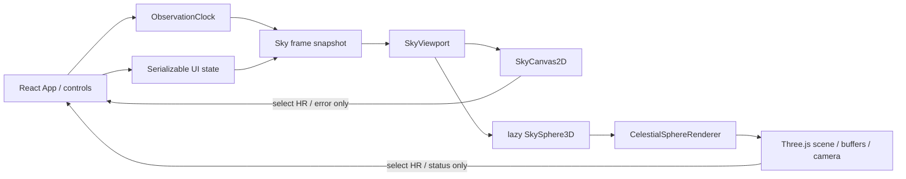
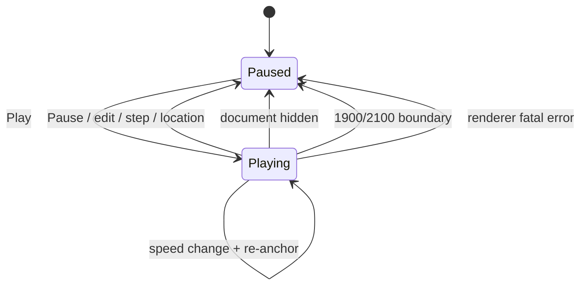

# Interactive Sky v2 実装契約

- 状態: Phase 2A / implemented and verified
- 対象: Web版
- 基準日: 2026-07-29
- 本文書の範囲: 時刻再生と、操作可能な3D天球
- 本文書で変更しないもの: 現行画面の情報設計、天文モデル、2D Canvas、検索・詳細・地点・レイヤーの基本動作

## 実装結果（2026-07-29）

この契約を基準に、時刻再生とWeb 3D天球を実装した。実装では描画subsetを
精密計算と共通化し、等級5.0以下、固有名、星座線に必要な1,630星を一つの
`THREE.Points`へ置く。公開計算APIと星表自体は8,404星を保持する。

- 3Dは利用者が選択した時だけlazy-loadし、初期表示は停止中の2Dである。
- 星座線は一つの`LineSegments`で時刻更新へ追従し、地平線下と背面を減光する。
- 5段階の薄明、ナイトモード、星名、星座線、選択HRを2Dと共有する。
- DOM星名は選択星を優先し、画面短辺に応じて最大12、6、3、1件へ抑える。
- 未フォーカスのCanvasはwheelを捕捉せず、フォーカス後だけzoomを有効にする。
  touchは`pan-y`として通常の縦スクロールを保ち、横dragを回転へ使う。
- 矢印、`+`/`-`、Home、画面上ボタン、一覧選択をキーボード・Canvas非操作時の
  代替経路として残す。
- WebGL初期化失敗、描画失敗、context lossは2Dへ戻し、検索と詳細を維持する。

現行実測ではVitest 316件、lint、本番build、デスクトップ・390×844・
240×844の実ブラウザ操作に成功した。自己ホスト日本語書体を含む初期転送は
約730.5 KiB gzip（予算768 KiB）、遅延3D依存グラフは約146.4 KiB gzip
（予算160 KiB）である。

## 1. 結論

3Dは現在の2D全天図を置き換えず、「空の方向を球として理解する」ための任意表示として追加する。初期表示と常設フォールバックは2Dのままとする。

- 2D: 観測に向く、北が上の天頂中心全天図。既存の正距方位図法を維持する。
- 3D: 観測者を中心としたローカル天球を外側から見る教育・空間把握モード。恒星までの距離ではなく、方向だけを単位球面へ置く。
- 描画: `three@0.185.1`を明示的な操作時だけlazy-loadする。React Three Fiberは追加しない。
- 星: 8,404個を一つの`THREE.Points`と固定BufferGeometryで描く。恒星ごとのReact要素、Mesh、Spriteは作らない。
- 星座線: 現在の10星座・44線分を一つの`LineSegments`で描く。
- 時刻: 単調時計を注入できる観測時計を一つの正本とし、React表示と両レンダラーが同じ有効時刻を読む。
- 通常時: 常時60fpsループを持たず、操作中・再生中だけ描画する。
- 障害時: 3Dのロード失敗、WebGL初期化失敗、context lossはいずれもアプリ全体のエラーにせず、その場で2Dへ戻す。

## 2. 3Dが追加する価値

現在の2D全天図は「いま地平線上に何があるか」を一目で比較するのに最適である。一方、正距方位図法では次の関係が平面へ圧縮される。

- 地平線が球面を二分していること。
- 天頂・天底と四方位の立体的な関係。
- 星座が地平線をまたいで昇り、天頂付近を通り、沈む経路。
- 地平線下の選択星が、観測者から見てどちら側にあるか。
- 時間送りによる星空全体の回転方向。

3Dでは天球、地平面、天頂、天底、四方位を同時に見せ、ドラッグで視点を変えられる。このため「平面図を読む」だけでなく「自分の周囲の空として向きを理解する」価値が生まれる。

3Dは恒星までの実距離、視差、銀河内の三次元配置を表現しない。全恒星を同じ半径に置くことを、ヘルプで「方向を示す天球」と明記する。

## 3. 守る情報設計

新しい画面、ルート、モーダル、サイドバーは作らない。

| 現在の領域 | 維持する役割 | v2で加えるもの |
| --- | --- | --- |
| 上部ツールバー | アプリ名、地点、日時、現在地、ヘルプ | 追加しない |
| 左の星図領域 | 全天図、薄明、時刻操作 | 星図内の2D/3D切替、3D方向リセット、再生行 |
| 右の探索領域 | 検索、地平線上/すべて、一覧、詳細 | 選択同期のみ。配置は変えない |
| 右の表示設定 | 星座線、星名、ナイトモード | 項目を増やさない |
| モバイルタブ | 星を探す/表示設定 | 維持する |
| ヘルプ | 操作、プライバシー、計算上の注意 | 3D操作と天球表現の説明を追記 |

### コントロールの正確な配置

#### 星図表示切替

`SkyViewport`の一部として`星図表示`の二択セグメント`2D / 3D`を置く。

- 意味は同じ領域の表示方式を一つ選ぶ操作なので、`tablist`ではなく`radiogroup`とする。
- デスクトップおよびモバイル横向き: 星図フレーム右上、外周から12px内側の安全領域。全天円や方位文字と重なる場合はフレーム上辺の余白へ退避する。
- モバイル縦向き560px以下: モバイル日時の直後、星図の直前に44px以上の一行として置く。星図へ重ねない。
- 195px幅: 二択セグメントを残し、3D時だけ表示する方向リセットは44pxのアイコンボタンにする。アクセシブル名称は`3Dの向きを戻す`。
- 初期値は`2D`。Webでは保存せず、そのタブの間だけ保持する。

`星図表示`は描画方式の切替なので、右側の`表示設定`には入れない。

#### 3D方向リセット

- `3D`選択中だけ、星図表示切替の隣に`向きを戻す`を置く。
- 方向、ズームだけを初期姿勢へ戻す。日時、地点、検索、選択、レイヤーは変えない。
- 既存の`表示をリセット`も3D姿勢を初期化するが、従来どおり日時と地点は変えない。

#### 3D操作ヒント

- pointer操作の短いヒントは、デスクトップでは天球左下の空き余白へ置き、
  430px以下では右下へ移す。南ラベルとの矩形重複を許さない。
- 280px以下では可視ヒントを隠すが、Canvasの`aria-describedby`にある
  キーボード操作、一覧による代替、太陽位置の説明は維持する。

#### 時刻再生

既存`TimeControls`の中へ二行目`PlaybackControls`を追加する。

- 一行目: 現在の日時入力、−1時間/いま/＋1時間、表示をリセット。
- 二行目: 再生/一時停止、秒を含む時計`HH:mm:ss`、`再生速度`select、再生状態。
- 対応期間の注記は現在どおり末尾に置く。
- モバイル縦向き: 日時、時刻ステッパー、再生行の順に縦積みする。
- 195px幅: 再生/時計を一行、速度selectを次の一行へ送る。
- ツールバーとモバイル日時は再生中も現在の位置に残す。重複を避けるため、再生行の時計は時刻だけを表示する。

## 4. 2Dと3Dの表示契約

### 2D

現在の`SkyCanvas`を機能上の正本として残す。

- 天頂中心、北上、東右。
- 地平線上だけを描く。
- 3D chunkが未取得でも直ちに使用できる。
- WebGLが使えない、失われた、復旧できない場合のフォールバックになる。
- 3D読み込み中も消さず、上に`3Dを準備しています…`というstatusを重ねる。

実装時は責務を明確にするため、現在のコンポーネントを`SkyCanvas2D`へ改名してよい。ただし描画結果と操作は回帰させない。

### 3D

3Dはローカル水平座標の単位球を外から眺めるcelestial globeとする。

- 球面半径は論理値`1`。
- `+X`: 東。
- `+Y`: 北。
- `+Z`: 天頂。
- 地平面: `Z = 0`。
- 天底: `-Z`。
- 恒星は方向だけを球面に置く。
- 地平線上の恒星は通常の明度で描く。
- 地平線下の恒星は低い不透明度で描き、半透明の地面半球と`地平線下`状態で区別する。
- 2Dの`地平線上/すべて`は引き続き探索一覧の範囲であり、3Dのカメラやレイヤーを暗黙に変更しない。
- 薄明statusの二行目は3D時だけ`天球上で地平線下を暗く表示しています`へ変え、現在の2Dコピーと混同させない。

3Dの薄明表示は現在の5段階の背景色を引き継ぐ。ナイトモードはThree.js material、DOM overlay、フォーカス、フォールバック通知を一緒に赤系へ変える。

## 5. Three.jsを選ぶ理由

| 観点 | Canvas 2Dで独自3D | Three.js |
| --- | --- | --- |
| 初期bundle | 小さい | lazy chunkが増える |
| 8,404星の毎フレーム描画 | CPUで再投影・再描画 | 固定GPU bufferを一描画呼び出し |
| 奥行き・球面・地平面 | 深度順、clip、透過を独自実装 | depth bufferとscene graphを利用可能 |
| カメラ | 行列、制約、gestureを独自実装 | cameraとOrbitControlsを限定利用 |
| 選択 | 画面座標indexを独自管理 | Raycasterをclick時だけ利用可能 |
| context loss | Canvas 2Dでは問題が小さい | 明示的な復旧契約が必要 |
| 保守 | 依存は少ないが描画基盤を自作 | 描画基盤を依存へ委ね、アプリ固有ロジックへ集中 |

採用はThree.jsとする。理由は、8,404星を毎フレームReact/CPUで扱わず、固定buffer、深度、カメラ、raycast、disposeを一つの描画境界へ閉じ込められるためである。

React Three Fiberは採用しない。

- 現在の画面はscene graphをReactで組み立てる必要がない。
- Reactの再レンダーと高頻度カメラ更新を分離しやすい。
- 追加bundleと抽象化を避けられる。
- Three.jsの破棄、context loss、描画要求をadapterで明示できる。

OrbitControlsはポインターのorbit/dolly実装だけを利用する。`enablePan = false`、自動回転なし、通常時dampingなしとし、標準のキーボードpanは接続しない。キーボードはアプリ側で回転・ズームへ写像する。

## 6. 恒星と線のbuffer

### 恒星

J2000.0の赤道座標を一度だけ単位ベクトルへ変換する。

```text
x = cos(dec) × cos(ra)
y = sin(dec)
z = cos(dec) × sin(ra)
```

| buffer | 型 | 要素 | 概算 |
| --- | --- | ---: | ---: |
| position | `Float32Array` | 8,404 × 3 | 100,848 bytes |
| magnitude | `Float32Array` | 8,404 | 33,616 bytes |
| color | normalized `Uint8Array` | 8,404 × 3 | 25,212 bytes |
| pointIndexToHr | `Uint16Array`、CPUのみ | 8,404 | 16,808 bytes |
| flags | `Uint8Array`、CPUのみ | 8,404 | 8,404 bytes |

GPUへ送る恒星属性は約156KiB、CPUのindex/flagを含めても約181KiBである。

- `THREE.Points`は一つ。
- 恒星ごとのObject3Dは作らない。
- B−V色と等級から色・point sizeをshaderで決める。
- point fragmentは円形にclipし、明るい星だけ小さなglowを持つ。
- 2D Canvasと3D rendererは共通の`skyDevicePixelRatio`を使い、device pixel
  ratioを1–2倍へ制限する。非有限値、0、負値は1倍へ戻す。低電力端末で
  動的に品質を変える実装はv2初版へ入れない。
- Raycasterはpointer-upまたはEnter選択時だけ実行し、point indexをHRへ戻す。

### 時刻・地点の反映

8,404個のpositionを再uploadしない。天文ドメインへ次の純粋関数を追加し、その回転行列を`celestialGroup.matrix`へ設定する。

```ts
type Matrix3x3 = readonly [
  number, number, number,
  number, number, number,
  number, number, number,
];

function equatorialJ2000ToHorizontalMatrix(
  date: Date,
  location: ObservingLocation,
): Matrix3x3;
```

行列はJ2000.0から観測日の歳差、地方恒星時、観測緯度を合成し、既存`calculateStarPosition`と同じ東・北・上の結果を返す。計算はFloat64で行い、Three.jsへ渡す時だけFloat32へ落とす。

### 星座線

現在の10星座・44線分を使う。

- 一つの`LineSegments`。
- 88端点、`Float32Array(88 × 3)`で約1KiB。
- 恒星と同じ`celestialGroup`に置き、同じ回転行列を使う。
- fragmentへ変換後の高度を渡し、地平線の上下で不透明度を変える。
- 星座名はtexture化せず、最大12個までのDOM overlayとして、カメラ変更時だけ位置を更新する。

### ローカル座標の固定要素

次は`localFrameGroup`へ置き、日時では回転させない。

- 地平線の大円。
- 30度、60度の高度円。
- 半透明の地面半球。
- 北・東・南・西。
- 天頂・天底。

## 7. Reactとレンダラーの所有境界



### Reactが所有する

- `viewMode: "2d" | "3d"`。
- 観測時計の再生状態、速度、基準時刻。
- 地点。
- レイヤー。
- 選択HR。
- 探索範囲。
- 3Dの`loading | ready | fallback | context-lost`状態。
- 利用者へ見せるエラー、status、aria-live文。

### レンダラーが所有する

- Scene、Camera、WebGLRenderer、OrbitControls。
- BufferGeometry、Material、Shader、Raycaster。
- pointer gesture中の一時座標。
- camera poseの高頻度変更。
- resize、render request、GPU resourceの破棄。
- 1フレーム内の一時行列と投影結果。

React stateをpointer moveや各frameで更新しない。camera poseは操作終了時だけReactへcommitし、再mount・表示切替に必要な最小値を保持する。

### 公開するadapter

```ts
type CameraPose = {
  azimuthDeg: number;
  polarDeg: number;
  distance: number;
};

type SkyFrameSnapshot = {
  instantMs: number;
  location: ObserverLocation;
  layers: LayerSettings;
  selectedHr: number | null;
  twilight: TwilightPhase;
};

type RendererStatus =
  | { kind: "ready" }
  | { kind: "context-lost"; message: string }
  | { kind: "failed"; message: string };

interface SkyRendererAdapter {
  mount(canvas: HTMLCanvasElement): void;
  resize(width: number, height: number, dpr: number): void;
  update(snapshot: SkyFrameSnapshot): void;
  requestRender(): void;
  resetCamera(): void;
  getCameraPose(): CameraPose;
  dispose(): void;
}
```

コールバックは`onSelect(hr)`、`onCameraPoseCommit(pose)`、`onStatus(status)`の三種類に限定する。effect内で再購読しないよう、最新callbackはrefまたはReactの安定したeffect eventから読む。

### 推奨モジュール境界

```text
features/sky/
  SkyViewport.tsx
  SkyCanvas2D.tsx
  viewMode.ts
  three/
    SkySphere3D.tsx
    CelestialSphereRenderer.ts
    buildCatalogBuffers.ts
    buildLocalFrame.ts
    cameraController.ts
    picking.ts
    shaders.ts
    types.ts
features/time/
  PlaybackControls.tsx
  observationClock.ts
  useObservationClock.ts
```

`three/*`以外から`three`をimportしない。`SkyViewport`はdynamic importの境界と2D fallbackだけを担当する。

## 8. 3Dカメラと方向の手掛かり

### 初期姿勢

- OrthographicCamera。
- targetは球の中心。
- 単位球に対してcamera位置は`(0, 0, 3.1)`で、`+Z`の天頂から球中心を見る。
- camera upは`+Y`の北。初期画面では北が上、東が右になる。
- 直交投影の半幅は1.18。画面比率に応じて上下または左右を広げる。
- 地平線は円として見せ、天頂・天底は画面中心から上下へ14–28px離す。

panとrollは許可しない。OrbitControlsでcameraを球の周囲へ回し、zoomは
0.75〜2.5へclampする。resetはcamera位置、up、target、zoomを同時に
決定値へ戻す。

### 常時見える手掛かり

- 地平線の太い大円。
- 半透明の地面半球。
- 北・東・南・西・天頂・天底のDOM label。camera quaternionと
  OrbitControlsへ追従し、球中心より背面はopacity 0.44へ減光する。
- 天頂・天底は画面高に応じた14–28pxのoffsetで画面中心から離す。
- 30度、60度の細い高度円。
- 選択星はaccent色の二重ring。地平線下なら破線と`地平線下`を併記する。

方向labelは描画textureではなくDOM overlayにし、高DPI、forced colors、文字拡大へ対応する。Canvasそのものは補助的な画像説明を持つ。

## 9. 入力契約

| 入力 | 動作 |
| --- | --- |
| 左ドラッグ | 球の周囲をorbitする |
| wheel | 星図領域がfocus済みの時だけzoom。未focusならページscrollを奪わない |
| 一本指、横向き/desktop相当 | orbit |
| 一本指、portrait | 横方向優位のgestureだけ方位回転。縦方向はページscroll |
| 二本指 | pinch zoomとorbit |
| クリック/タップ | 5 CSS px未満の移動なら最寄りの描画星を選択 |
| ←/→ | 方位を5度回転 |
| ↑/↓ | 視点高度を5度回転 |
| `+`/`-` | 10% zoom |
| Home | 3D方向を初期姿勢へ戻す |
| Enter | 画面中央のcrosshairに最も近い星を選ぶ |
| Escape | gestureを取り消し、方向statusだけ更新する |

focus可能なwrapperは`role="group"`とし、`role="application"`は使わない。keyboard説明を`aria-describedby`で関連付ける。方向のaria-liveは操作中に連続更新せず、pointer-upまたは最後のkey入力から300ms後に一度だけ通知する。

OrbitControlsのdampingとautoRotateは既定で無効にする。時刻再生は天球の物理的な時間変化であり、カメラの自動回転とは分離する。

## 10. 観測時計と再生

### 状態

```ts
type PlaybackSpeed = 1 | 60 | 600 | 3600;
type PlaybackPhase = "paused" | "playing";
type PauseReason =
  | "user"
  | "edit"
  | "document-hidden"
  | "date-boundary"
  | "renderer-error";

type ObservationClockState = {
  anchorInstantMs: number;
  anchorMonotonicMs: number;
  phase: PlaybackPhase;
  speed: PlaybackSpeed;
  pauseReason: PauseReason;
};
```

有効時刻は次で求める。

```text
paused:
  effective = anchorInstantMs

playing:
  effective =
    anchorInstantMs
    + (monotonicNow - anchorMonotonicMs) × speed
```

各frameの差分を足し込まない。`performance.now()`を注入できる`MonotonicClock`から計算し、tab throttlingやframe落ちで時刻が累積誤差を持たないようにする。

### 速度

| 表示 | 意味 | 主用途 |
| --- | --- | --- |
| 1× | 実時間 | 現在の空を追う |
| 60× | 1秒で1分 | 星の短い動き |
| 600× | 1秒で10分 | 昇降の確認 |
| 3600× | 1秒で1時間 | 一夜の流れ |

初期速度は60×、初期状態は一時停止。Webでは保存しない。負方向再生はv2初版へ入れず、既存の−1時間を使う。

### 操作規則

- Play: 現在の有効時刻をanchorにして開始する。
- Pause: その瞬間の有効時刻をanchorへ確定する。
- 速度変更: 変更瞬間の有効時刻を確定してから新しい速度で再anchorする。
- 日時入力、−1時間、いま、＋1時間、地点変更: 先にpauseし、その後で既存処理を行う。
- 2D/3D切替、レイヤー変更、星選択: 再生を止めない。
- 1900〜2100年の端: 端へclampし、pauseして`対応期間の終端に達したため停止しました`をalertする。
- datetime-localは再生中も編集可能だが、focusした時点でpauseする。
- 時計の連続値自体は`aria-live`にしない。Play/Pause、速度、端到達だけをpolite/alertで通知する。

Reactの読者向け時計は最大4Hzで更新する。3D rendererは再生中最大30fpsで同じ`effectiveInstant`を読む。2DはCPU負荷を抑えるため最大8fpsで再計算する。



## 11. 描画スケジューリング

Three.jsの常時loopは持たない。

- idle: state、resize、camera change、選択変更で一回だけ描画要求をまとめる。
- drag/pinch中: 最大60fps。
- playback中: 最大30fps。
- reduced motion + playback: 最大4fpsの段階更新。
- 2D playback: 最大8fps。
- offscreen: 描画を0fpsにし、表示へ戻った時に現在の有効時刻で一回描く。

Three.jsの`renderer.setAnimationLoop(callback)`を利用し、不要な時は`setAnimationLoop(null)`にする。idleの単発描画は重複する要求を一つのframeへcoalesceする。

## 12. visibility、reduced motion、offscreen

### Document visibility

`visibilitychange`で`document.hidden`になった時:

1. 有効時刻をanchorへ確定する。
2. 再生中なら`document-hidden`理由でpauseする。
3. 2D/3Dのframe loopを止める。
4. visibleへ戻っても自動再生しない。
5. `画面を離れたため時刻再生を一時停止しました`を一度だけ通知する。

### Offscreen

`IntersectionObserver`で星図領域の交差率が10%未満になった時:

- rendererのframe loopだけを止める。
- documentがvisibleなら観測時計は継続する。
- 再表示時に最新時刻へ一回で追いつく。
- 10%境界付近の揺れを避けるため、停止100ms、再開50msのdebounceを持つ。

### Reduced motion

`prefers-reduced-motion: reduce`では:

- camera damping、慣性、focus-to-star補間、mode crossfadeを無効にする。
- dragとkeyboardの直接操作は1入力1更新にする。
- 利用者が明示的にPlayした時刻再生は維持するが、星図更新を4fpsへ下げる。
- 時刻と選択結果は省略しない。

## 13. WebGL失敗とcontext loss

### 初期化

3Dを選択した時だけ次を順に行う。

1. 一時canvasでWebGL2 contextを確認する。
2. `import("./three/SkySphere3D")`する。
3. `WebGLRenderer`を`antialias: false`、`stencil: false`、`preserveDrawingBuffer: false`、`powerPreference: "low-power"`で作る。
4. Sceneとbufferを作る。
5. readyになるまで2Dを表示し続ける。

失敗時:

- `viewMode`要求は3Dのまま記録してよいが、effective rendererを2Dにする。
- 星図上部に`3D表示を利用できないため、2Dで表示しています`をalertではなくpolite statusで出す。
- 検索、詳細、時刻、地点、レイヤーは継続する。
- アプリ全体のErrorBoundaryへ投げない。

### Context loss

`webglcontextlost`で`preventDefault()`し、次を行う。

- animation loopを止める。
- camera pose、選択、時刻、地点をCPU側に保持する。
- 即座に2Dへ切り替える。
- `3D表示が中断されたため2Dへ切り替えました`を通知する。

`webglcontextrestored`後も古いbuffer/materialを再利用しない。全GPU resourceをCPU bufferから再生成し、利用者の`3Dを再試行`操作で戻す。同一sessionで2回context lossしたら3Dをsession中無効にし、再試行を提示しない。

unmountまたはmode切替時は次を必ず破棄する。

- controlsのevent listener。
- geometry、material、texture。
- rendererのanimation loop。
- ResizeObserver、IntersectionObserver、media query listener。
- renderer本体の`dispose()`。

## 14. モバイル

### Portrait

- 390pxで現在の順序を維持する: toolbar、日時、2D/3D、星図、薄明、時刻、探索/設定。
- 星図は正方形を維持する。
- 3DのDOM labelは北・東・南・西・天頂・天底、選択星を優先し、
  それ以外を段階的に減らす。
- 一本指の縦scrollを奪わない。
- 44px以上のmode、reset、play、speed controlを維持する。

### Landscape

- 新しい二分割画面にはしない。
- 2D/3Dと方向resetは星図へoverlayし、縦寸法を増やさない。
- 星図は`min(72svh, available width)`へ収め、最低240pxを目標とする。
- 時刻行は直後に置き、ページscrollを許す。
- 端末回転ではcamera pose、日時、選択を維持し、ResizeObserverでdrawing bufferだけを更新する。

### 195px / 200% zoom

- 横scrollを発生させない。
- mode二択、方向reset、play/pause、速度selectは折り返す。
- 3D labelは北・東・南・西、天頂・天底、選択星だけにする。
- 300px以下は回転4方向・reset・zoomを横一段にし、260px以下では
  各操作を28pxまで縮めて天球中心の遮蔽と横scrollを避ける。
- Canvas drawing bufferが0にならないことを検査する。

## 15. アクセシビリティと一覧同期

- 3D wrapperはTabでfocusでき、常に2px以上のfocus表示を持つ。
- Canvasを8,404個のDOM要素へ展開しない。
- 星検索・一覧・詳細を主要な非視覚代替として維持する。
- 3Dで選択したHRは同じ`selectedHr`を更新し、詳細へ直ちに反映する。
- 命名星が現在の一覧にあれば、そのrowの`aria-selected`とroving tab stopを同期する。
- 地平線下で一覧外なら、現在の復旧導線`すべてで見る`を維持する。
- 名称未収録の星は詳細へ`HR n`として表示し、一覧を無理に生成しない。
- list選択でcameraを自動回転させない。大きな予期しない動きを避け、選択ringと方向indicatorだけを更新する。
- Enterはcrosshair付近の星を選ぶため、keyboardだけでも3Dから選択できる。
- pointer selection、keyboard selectionとも、現在のatomic selection statusを一度だけ更新する。
- 再生時計は連続読み上げしない。
- 3D操作説明を画面外descriptionとヘルプの両方へ置く。
- forced colorsではDOM overlayとcontrolをsystem色にする。星のB−V色情報はCanvas内で保持し、地平線・選択ringを太さと線種でも区別する。

## 16. lazy-loadとbundle予算

実装後の初期routeは、UI本体に加えて自己ホストする日本語フォント2書体を
含む。hard gateは初期合計768 KiB gzip・12ファイル以下で、3Dは引き続き
利用者が選ぶまで初期routeへ含めない。

| 対象 | 目標 | hard gate |
| --- | ---: | ---: |
| 初期route | 自己ホストフォント込み | 初期合計768KiB以下・12ファイル以下 |
| `sky-3d` lazy chunk | 120KiB gzip以下 | 160KiB gzip以下 |
| 3D起動後の追加request | JS 1、必要ならshader同梱 | 3ファイル以下 |
| 恒星buffer | runtime生成 | catalogの重複download禁止 |

契約作成時の`three@0.185.1`は、配布されるminified ES module全体がローカル測定で約86.8KiB gzipだった。実buildでは直接importとtree shakingを使い、OrbitControls、shader、adapterを含むchunkを120KiB以下へ収める。

- `React.lazy`または同等のdynamic importを、利用者が3Dを選んだ時だけ開始する。
- 初期表示でThree.jsをimportしない。
- v2初版はidle prefetchしない。
- barrel importを避け、`three`と`three/addons/controls/OrbitControls.js`から必要なものだけimportする。
- shaderは文字列moduleとして同じchunkへ入れ、別network requestにしない。
- catalog JSONを3D chunkへ複製しない。
- budget検査は初期assetに加えて、`sky-3d` chunkの論理名またはmanifest参照を検査する。

## 17. 決定論的テスト

### 天文行列

- 共有fixtureの東京、Greenwich、Sydney、赤道、高緯度を使う。
- Polaris、Sirius、Vega、Arcturusを含む。
- 行列で変換した単位ベクトルと既存`calculateStarPosition`の東・北・上を角距離で比較する。
- Float64の許容差は`1e-10` rad、Float32へ渡した後は`1e-5` radとする。
- 天頂では方位角だけを比較しない。

### Buffer

- countが8,404。
- HR順、先頭、末尾、catalog lock hashを検査する。
- 全positionが有限で、長さ`1 ± 1e-6`。
- magnitudeとcolorの範囲。
- point indexからHR、HRからpoint indexの往復。
- 44星座線が存在するHRだけを参照する。
- buffer builderは同じ入力からbyte-identicalなTypedArrayを返す。

### 観測時計

`performance.now()`を直接読まず、fake monotonic clockを注入する。

- 60×で2.5秒進めると150秒進む。
- pause/resumeで隙間を加算しない。
- 速度変更時に時刻が飛ばない。
- document hiddenで正確な瞬間にpauseする。
- offscreenはclockを止めずrendererだけを止める。
- 1900/2100年でclamp・pause・理由を返す。
- 日時編集と地点変更が先にpauseする。

### Cameraとgesture

- reset poseを固定値で検査する。
- arrowが12度、zoomが1段20%。
- zoomを0.75〜2.5へclampする。
- dragとclickの5px閾値。
- pointer cancelで選択しない。
- Homeでcamera位置、up、target、zoomを同時に戻す。
- reduced motionでdampingが無効。

### Renderer lifecycle

- idleの複数render要求が一frameになる。
- playback 30fps、reduced motion 4fps、2D 8fpsの上限。
- offscreenで0frame。
- dispose後にlistener、observer、animation loopが残らない。
- 初期化例外、dynamic import拒否、WebGL2なしで2Dを維持する。
- `forceContextLoss()`相当で2Dへ切替え、復元時にresourceを再生成する。

### React/UI

- 2Dが初期選択。
- 3D loading中も2Dと検索が使える。
- 3D選択、list選択、詳細、aria-liveが同じHRになる。
- Play/Pause、速度、日時編集、地点変更の状態遷移。
- mobile mode controlとtabpanelのTab順。
- 195pxで横overflowなし。

## 18. Render-ready QA

### 固定シナリオ

- 地点: 東京。
- 日時: `2026-07-29T03:30:00+09:00`。
- camera: reset pose。
- DPR: 1。
- viewport:
  - 1536 × 1024。
  - 390 × 844。
  - 844 × 390。
  - 240 × 844。
  - 195 × 844。

### 必須状態

1. 2D初期表示。
2. 3D loading overlayからready。
3. 3D reset pose、昼/薄明/夜。
4. drag前後で北・東・南・西・天頂・天底のtransformと前後opacityが追従する。
5. wheel/pinchの最小・最大zoom。
6. canvas選択とlist/detail同期。
7. 地平線下のSirius選択。
8. Play 60×と3600×。
9. reduced motion。
10. forced colors。
11. WebGL初期化失敗。
12. context lossから2D fallback。
13. portrait/landscape回転後のpose維持。

### 合否

- page、toolbar、探索、詳細の情報設計が現行と同じ。
- 星図切替でblank frameを見せない。
- console error/warning 0。意図したcontext-loss通知は捕捉して説明する。
- 3D ready後、恒星は1 draw call、星座線は1 draw callを目標とする。
- desktopの操作/再生中p95 frame time 16.7ms以下。
- 中位mobileの再生中p95 frame time 33ms以下。
- pointer/key入力から視覚更新まで100ms以下。
- document hiddenから100ms以内にloop停止。
- offscreenから150ms以内にloop停止。
- 20回の2D/3D切替後、renderer.infoのgeometry/texture数が増え続けない。
- 390px、195pxとも`scrollWidth === innerWidth`。
- keyboardだけでmode切替、3D回転、zoom、reset、中央星選択、一覧移動ができる。

pixel screenshotだけを天文正確性の合否にしない。固定ChromiumとSwiftShaderを使えるCIでは低い差分率のvisual regressionを追加できるが、blocking gateは行列、screen projection、buffer hash、DOM状態とする。GPUやfontの差がある環境ではスクリーンショットを人が比較する。

## 19. 実装順

1. 観測時計を純粋モデルとして追加し、現在の静止時刻操作を同じAPIへ移す。
2. `equatorialJ2000ToHorizontalMatrix`と既存計算との一致テストを追加する。
3. `SkyViewport`へ2Dをそのまま収め、mode controlだけを追加する。
4. buffer builderとcamera controllerをDOMなしで実装・テストする。
5. Three.jsをlazy chunkとして追加し、静止した3D reset poseを描く。
6. pointer、touch、keyboard、選択同期を追加する。
7. 時刻再生とrender schedulingを接続する。
8. visibility、offscreen、reduced motionを接続する。
9. 初期化失敗、context loss、disposeを実装する。
10. mobile、forced colors、bundle、render-ready QAを通す。

各段階で2Dの既存テストと全`web:check`を通す。3Dが未完成の途中commitでも2Dは使用可能でなければならない。

## 20. Doneの条件

- 2Dが初期値かつ常時フォールバックとして動く。
- 3Dが描画対象1,630星を単一の固定bufferから描き、公開計算APIと星表は
  8,404星を維持する。
- 3Dが時刻・地点・選択・レイヤーと同期する。
- 3D操作がpointer、wheel、touch、keyboard、resetで完結する。
- 時刻再生が決定論的で、1900〜2100年とvisibilityを守る。
- 常時loop、恒星ごとのReact node、catalogの二重downloadがない。
- WebGL失敗とcontext lossでアプリ全体が落ちない。
- 390px、landscape、195px、reduced motion、forced colorsを通す。
- 初期routeが自己ホストフォント込み768KiB gzip以下・12ファイル以下で、
  遅延3D依存グラフが160KiB gzip以下。
- 自動テストと固定状態のrender-ready QAが完了する。

## 21. 参照

- Three.js BufferGeometry: <https://threejs.org/docs/pages/BufferGeometry.html>
- Three.js Points: <https://threejs.org/docs/pages/Points.html>
- Three.js OrbitControls: <https://threejs.org/docs/pages/OrbitControls.html>
- Three.js WebGLRenderer: <https://threejs.org/docs/pages/WebGLRenderer.html>
- Three.js Rendering on Demand: <https://threejs.org/manual/en/rendering-on-demand.html>
- MDN Page Visibility API: <https://developer.mozilla.org/en-US/docs/Web/API/Page_Visibility_API>
- MDN `webglcontextrestored`: <https://developer.mozilla.org/en-US/docs/Web/API/HTMLCanvasElement/webglcontextrestored_event>
- MDN `prefers-reduced-motion`: <https://developer.mozilla.org/en-US/docs/Web/CSS/Reference/At-rules/%40media/prefers-reduced-motion>
- 現行デザイン: `docs/design/design-system.md`
- 現行天文モデル: `docs/astronomy-model.md`
- 星表lock: `shared/catalog/bright-stars.lock.v1.json`
